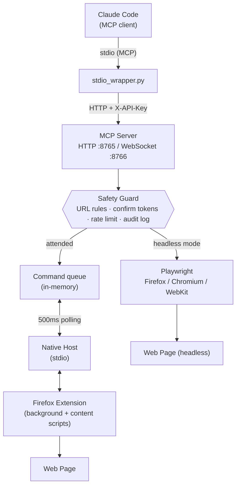

# ClaudeCodeBrowser

[](https://opensource.org/licenses/MIT)
[](https://github.com/acornelissen/ClaudeCodeBrowser/releases)
[](https://addons.mozilla.org/firefox/)
[](https://modelcontextprotocol.io)
[](https://www.python.org)
[](#installation)

A browser automation system for Claude Code that enables AI-powered interaction with web pages — with **built-in safety guards for humans**. Take screenshots, click elements, type text, navigate pages, and **force refresh browser tabs** when launching development servers. Drive your real Firefox through the extension, or run fully headless (Firefox, Chromium, or WebKit) via Playwright.

The browser extension installs as **ClaudeCodeBrowserX**; the MCP server, native
messaging host and install directory keep the `claudecodebrowser` name.

## Credits

**Originally created by Andre Watson** ([@nanogenomic](https://github.com/nanogenomic)) — dre@ligandal.com
**Organization:** [Ligandal Inc.](https://ligandal.com) · <https://github.com/nanogenomic/ClaudeCodeBrowser>
**License:** MIT · **Copyright:** 2025 Andre Watson (nanogenomic), Ligandal Inc.

This repository is a **fork** maintained by Albert Cornelissen
([@acornelissen](https://github.com/acornelissen)). All of the original design
and implementation is Andre's work; the fork's changes are listed from 1.5.0
onwards in [the changelog](CHANGELOG.md), and it is distributed under the same
MIT license with the original copyright retained.

## Features

- **Screenshots** - Capture visible area or full page screenshots
- **Click Automation** - Click elements by CSS selector, XPath, text, or coordinates
- **Typing** - Type text into inputs with simulated keystrokes
- **Page Navigation** - Navigate to URLs, create/close/focus tabs
- **Page Refresh** - Force refresh tabs after server restarts (bypass cache)
- **Element Inspection** - Find elements, get page info, highlight elements
- **JavaScript Execution** - Run arbitrary JS in browser context
- **Console & Network Logging** - Capture console output and network traffic (fetch, XHR, WebSocket, beacons) for debugging
- **Safety Guards** - URL restrictions, protected-site confirmation, read-only mode, rate limiting, credential-field protection, audit log ([details](#safety-guards))
- **Headless Mode** - Unattended automation via Playwright: Firefox, Chromium, or WebKit
- **MCP Integration** - Model Context Protocol server for Claude Code

## Browser Support

| Browser | Attended (extension) | Headless (Playwright) |
|---------|---------------------|----------------------|
| Firefox | ✅ Primary target (Manifest V2, AMO-signable) | ✅ `CLAUDE_BROWSER_ENGINE=firefox` (default) |
| Chromium / Chrome | 🧪 Experimental build via `scripts/build-chrome.sh` (MV3) | ✅ `CLAUDE_BROWSER_ENGINE=chromium` |
| WebKit (Safari engine) | — | ✅ `CLAUDE_BROWSER_ENGINE=webkit` |

Attended mode drives your real browser with your logged-in sessions. Headless mode launches a fresh, isolated browser — best for CI, servers, and unattended tasks. See [Headless Mode](#headless-mode).

## Overview

ClaudeCodeBrowser consists of four main components:

1. **Firefox WebExtension** (*ClaudeCodeBrowserX*) - Runs in the browser to execute automation commands
2. **Native Messaging Host** - Bridge between the extension and local server
3. **MCP Server** - Model Context Protocol server exposing browser automation tools
4. **Browser Agent** - Python agent for high-level browser automation

## Architecture

### Dual-Server Design

ClaudeCodeBrowser uses a **dual-server architecture** for maximum reliability and flexibility:

| Server | Port | Protocol | Purpose |
|--------|------|----------|---------|
| **HTTP Server** | 8765 | HTTP REST | MCP tool calls, health checks, command polling, screenshot retrieval |
| **WebSocket Server** | 8766 | WebSocket | Real-time browser communication (reserved for future use) |

**Why Two Servers?**
- **HTTP (8765)**: Primary communication channel. Claude Code's MCP client sends tool requests here. The browser extension polls this server every 500ms for pending commands.
- **WebSocket (8766)**: Reserved for real-time bidirectional communication when instant responses are needed.

### Communication Flow



### Request Flow (Step by Step)

1. **Claude Code → MCP Server**: Tool call via HTTP POST to `localhost:8765/mcp/call`
2. **MCP Server → Command Queue**: Command is queued with unique ID
3. **Browser Extension → MCP Server**: Extension polls `localhost:8765/browser/poll` every 500ms
4. **MCP Server → Extension**: Pending command returned to extension
5. **Extension → Web Page**: Command executed (screenshot, click, type, etc.)
6. **Extension → MCP Server**: Response posted to `localhost:8765/browser/response`
7. **MCP Server → Claude Code**: Result returned to original MCP call

### Native Host (Optional Path)

The native messaging host (`claudecodebrowser_host.py`) provides an alternative communication path:
- Used when the browser extension needs to communicate with the local file system
- Handles screenshot saving directly to disk at `~/.claudecodebrowser/screenshots/`, created `0700` (override with `CLAUDE_BROWSER_SCREENSHOTS_DIR`)
- Starts the MCP server when it is not running, and restarts it if it dies.
  Before trusting whatever is on port 8765 it requires proof that the listener
  holds the shared API token, so a process that squats the port cannot receive
  the token or issue browser commands. It only ever terminates a Python
  process whose script argument is our own server, re-checked immediately
  before each signal; anything else holding the port is left alone and
  reported as a failure

## Installation

### Prerequisites

**System Python websockets** (required for WebSocket server on port 8766):
```bash
sudo apt install python3-websockets      # Linux
python3 -m pip install websockets        # macOS
```

Use `python3 -m pip`, not `pip3`: on a machine with both mise and Homebrew
Pythons they can be different interpreters, and the server only sees the one
`python3` resolves to.

Without this, the server runs in HTTP-only mode and `browsers_connected` will always show 0. Everything else still works over HTTP.

### Quick Install (Linux and macOS)

```bash
cd ClaudeCodeBrowser
./scripts/install.sh
```

### macOS notes

The install script handles these automatically, but if you are installing manually:

- The native messaging manifest goes in `~/Library/Application Support/Mozilla/NativeMessagingHosts/` (not `~/.mozilla/`).
- The native host must live outside TCC-protected folders (`~/Documents`, `~/Desktop`, `~/Downloads`). Firefox is not allowed to execute anything there and fails with `Operation not permitted`. The default install location `~/.claudecodebrowser` is fine.
- The manifest should point to a wrapper script with an absolute `python3` path. Firefox launches native hosts with a minimal PATH, so `#!/usr/bin/env python3` may not resolve (e.g. Homebrew installs).

### Manual Installation

1. **Install the MCP server and agent:**
   ```bash
   mkdir -p ~/.claudecodebrowser/{native-host,mcp-server,agent,screenshots,logs}
   cp native-host/* ~/.claudecodebrowser/native-host/
   cp mcp-server/* ~/.claudecodebrowser/mcp-server/
   cp agent/* ~/.claudecodebrowser/agent/
   chmod +x ~/.claudecodebrowser/**/*.py
   ```

2. **Install native messaging manifest for Firefox:**

   `native-host/claudecodebrowser.json` ships with a placeholder `path`.
   Firefox needs a real absolute path there and does **not** expand `~` or
   `$HOME`, so substitute it while copying:

   ```bash
   # Linux
   mkdir -p ~/.mozilla/native-messaging-hosts
   sed "s|/ABSOLUTE/PATH/TO/HOME|$HOME|" native-host/claudecodebrowser.json \
     > ~/.mozilla/native-messaging-hosts/claudecodebrowser.json
   # macOS
   mkdir -p ~/Library/Application\ Support/Mozilla/NativeMessagingHosts
   sed "s|/ABSOLUTE/PATH/TO/HOME|$HOME|" native-host/claudecodebrowser.json \
     > ~/Library/Application\ Support/Mozilla/NativeMessagingHosts/claudecodebrowser.json
   ```

   (`scripts/install.sh` writes this file for you, with the path already
   resolved — on macOS it points at a small launcher that pins the absolute
   `python3`, because Firefox starts native hosts with a minimal `PATH`.)

3. **Install the Firefox extension:**
   - Open Firefox and go to `about:debugging`
   - Click "This Firefox"
   - Click "Load Temporary Add-on..."
   - Select `extension/manifest.json`

4. **Configure Claude Code MCP:**
   Add to `~/.claude/settings.json`:
   ```json
   {
     "mcpServers": {
       "claudecodebrowser": {
         "command": "python3",
         "args": ["/home/YOUR_USER/.claudecodebrowser/mcp-server/stdio_wrapper.py"]
       }
     }
   }
   ```

### Windows Installation

**Quick install (PowerShell):**

```powershell
powershell -ExecutionPolicy Bypass -File scripts\install.ps1
```

This copies the components to `%USERPROFILE%\.claudecodebrowser`, generates the
`.bat` native-host wrapper with your Python path baked in, writes the native
messaging manifest, and registers it in the Windows registry. Then load the
extension (step 1 below) and add the printed MCP config to Claude Code.

**Manual steps:**

1. **Install the Firefox extension:**
   - Open Firefox and go to `about:debugging`
   - Click "This Firefox"
   - Click "Load Temporary Add-on..."
   - Select `extension/manifest.json`

2. **Register the native messaging host:**
   Update the path in `native-host/claudecodebrowser.json` to point to the `.bat` wrapper:
   ```json
   {
     "path": "C:\\path\\to\\ClaudeCodeBrowser\\native-host\\claudecodebrowser_host.bat"
   }
   ```
   Then register it in the Registry:
   ```powershell
   New-Item -Path 'HKCU:\Software\Mozilla\NativeMessagingHosts\claudecodebrowser' -Force | Out-Null
   Set-ItemProperty -Path 'HKCU:\Software\Mozilla\NativeMessagingHosts\claudecodebrowser' -Name '(Default)' -Value 'C:\path\to\ClaudeCodeBrowser\native-host\claudecodebrowser.json'
   ```

3. **Configure Claude Code MCP:**
   Add to `%USERPROFILE%\.claude\settings.json`:
   ```json
   {
     "mcpServers": {
       "claudecodebrowser": {
         "command": "python",
         "args": ["C:/path/to/ClaudeCodeBrowser/mcp-server/stdio_wrapper.py"]
       }
     }
   }
   ```

## Updating the Firefox Extension

The MCP server and native host are plain Python — pull the repo and restart
them and you're current. **The browser extension is separate**: it runs
inside Firefox and does not update from a `git pull`. How you update it
depends on how it was installed.

Build a versioned package (both scripts also emit `dist/updates.json` for
auto-update — see below):

```bash
# Linux / macOS
./scripts/package-extension.sh          # dist/claudecodebrowser-<version>.xpi
./scripts/package-extension.sh --sign   # signed via AMO (see below)
```

```powershell
# Windows
powershell -ExecutionPolicy Bypass -File scripts\package-extension.ps1
powershell -ExecutionPolicy Bypass -File scripts\package-extension.ps1 -Sign
```

**1. Temporary add-on (development).** If you loaded it through
`about:debugging` → *Load Temporary Add-on*, it is not persistent and does
not auto-update:

- Open `about:debugging#/runtime/this-firefox`
- Find ClaudeCodeBrowser and click **Reload**, or remove it and load the new
  `manifest.json`/`.xpi` again
- It is removed on Firefox restart, so you reload it each session

This is the quickest loop while developing, and it's where you are if you've
been "reloading the plugin" after each change. When the manifest gains a new
permission (v1.3.0 added `notifications`), a reload picks it up.

**2. Signed, self-distributed `.xpi` (recommended for real use).** A signed
extension installs permanently and can **auto-update**. Sign it through
Mozilla without a public listing:

1. Get the tooling. `web-ext` is pinned in `mise.toml`, so:
   ```bash
   mise install
   ```
2. Create an AMO API key at
   <https://addons.mozilla.org/en-US/developers/addon/api/key/> — "JWT
   issuer" and "JWT secret". **The secret is shown once.** Put both in
   `mise.local.toml`, which is gitignored:
   ```bash
   cp mise.local.toml.example mise.local.toml
   $EDITOR mise.local.toml
   ```
   mise exports them as `AMO_JWT_ISSUER` / `AMO_JWT_SECRET` for the signing
   script. Keep them out of `mise.toml` and out of your shell history.
3. Sign:
   ```bash
   mise run sign      # = ./scripts/package-extension.sh --sign
   ```
   This uploads to AMO's signer with `--channel=unlisted` (no public
   listing) and writes a signed `.xpi` plus `updates.json` to `dist/`.
4. Install the signed `.xpi` in Firefox: `about:addons` → gear →
   *Install Add-on From File*.

> **Never delete the add-on on AMO.** AMO keeps a deleted add-on's ID on a
> denylist, so it can never be signed under again — a later `web-ext sign`
> fails with `Conflict: Duplicate add-on ID found.` and the only way forward
> is a brand-new ID, which means a new add-on identity plus matching updates
> to `allowed_extensions` everywhere. Builds you already signed keep working
> (Firefox verifies the signature against Mozilla's CA offline, and
> `update_url` points at GitHub, not AMO), but you cannot ship another
> version under that ID. Leave unwanted add-ons in place instead.
>
> **If signing fails with `Getting details failed: Not Found`.** That is
> web-ext failing *after* the upload has already validated cleanly, when it
> tries to attach the new version to the existing add-on. Adding a version
> addresses the add-on by GUID, and AMO can answer 404 there — on both the
> submission API (`POST /addons/addon/{guid}/versions/`) and the signing API
> (`PUT /addons/{guid}/versions/{version}/`). Signing later versions normally
> works fine, so when this does happen suspect the add-on's state on AMO
> rather than the tooling: open
> <https://addons.mozilla.org/developers/>, check whether it is listed as
> incomplete, and either finish it there or upload the `.xpi` through that
> page.
>
> **Extension ID.** This fork uses a generated GUID, not upstream's
> `claudecodebrowser@ligandal.com`: AMO rejects a submission under an ID
> registered to a different account. If you fork this in turn you will need
> your own ID again — change `browser_specific_settings.gecko.id` and
> `allowed_extensions` in `native-host/claudecodebrowser.json`. Both
> installers read the ID from the manifest, so there is nothing else to edit,
> and `tests/test_extension_identity.py` checks the two agree. Get it wrong
> and native messaging fails silently.

**Auto-update is already wired** to GitHub Releases. The manifest carries:

```json
"update_url": "https://github.com/acornelissen/ClaudeCodeBrowser/releases/latest/download/updates.json"
```

That's a stable URL — it always resolves to the newest release's
`updates.json` — and the packaging scripts generate that `updates.json`
pointing at the matching versioned `.xpi`. So each new plugin version is just:

1. Bump `version` in `extension/manifest.json`.
2. `./scripts/package-extension.sh --sign` (or the `.ps1` on Windows) — writes
   the signed `claudecodebrowser-<version>.xpi` **and** `updates.json` into
   `dist/`.
3. Publish the release with both assets — one command:
   ```bash
   ./scripts/publish-release.sh            # or --draft to review before publishing
   ```
   It reads the version from the manifest, creates the `v<version>` release,
   and uploads the `.xpi` + `updates.json`. It uses the `gh` CLI if present
   (`gh auth login`), otherwise falls back to the GitHub API with
   `GITHUB_TOKEN` (needs `repo` scope).

   <details><summary>Prefer to run it by hand?</summary>

   With the `gh` CLI:
   ```bash
   VER=$(python3 -c "import json;print(json.load(open('extension/manifest.json'))['version'])")
   gh release create "v$VER" \
     "dist/claudecodebrowser-$VER.xpi" "dist/updates.json" \
     --title "v$VER" --notes "ClaudeCodeBrowser v$VER"
   ```

   With `curl` (set `GITHUB_TOKEN`):
   ```bash
   VER=$(python3 -c "import json;print(json.load(open('extension/manifest.json'))['version'])")
   REPO=acornelissen/ClaudeCodeBrowser
   ID=$(curl -sS -X POST "https://api.github.com/repos/$REPO/releases" \
     -H "Authorization: Bearer $GITHUB_TOKEN" \
     -d "{\"tag_name\":\"v$VER\",\"name\":\"v$VER\"}" | python3 -c "import json,sys;print(json.load(sys.stdin)['id'])")
   curl -sS -X POST "https://uploads.github.com/repos/$REPO/releases/$ID/assets?name=claudecodebrowser-$VER.xpi" \
     -H "Authorization: Bearer $GITHUB_TOKEN" -H "Content-Type: application/octet-stream" \
     --data-binary @"dist/claudecodebrowser-$VER.xpi"
   curl -sS -X POST "https://uploads.github.com/repos/$REPO/releases/$ID/assets?name=updates.json" \
     -H "Authorization: Bearer $GITHUB_TOKEN" -H "Content-Type: application/json" \
     --data-binary @"dist/updates.json"
   ```
   </details>

Installed copies check `releases/latest/download/updates.json`, see the higher
version, and update themselves within ~24h — or immediately via *Check for
Updates* in `about:addons`. (Format reference: Mozilla's
[updateURL manifest](https://extensionworkshop.com/documentation/manage/updating-your-extension/).)

> Forking? Set `CCB_REPO_SLUG=youruser/yourrepo` when packaging so the
> generated `update_link` points at your releases, and change the `update_url`
> in the manifest to match.

**3. Public AMO listing.** To distribute on
[addons.mozilla.org](https://addons.mozilla.org), run
`web-ext sign --channel=listed` (or submit the `.xpi` in the Developer Hub)
and go through Mozilla's review. Users then install and update like any store
add-on. Best when you want the extension discoverable; heavier because each
version is reviewed.

> Whichever route: bump `version` in `extension/manifest.json` first (it must
> increase for Firefox to treat a build as an update), keep it in step with
> the server version, then repackage.

## Usage

### Starting the MCP Server

```bash
~/.claudecodebrowser/start-server.sh
```

Or directly:
```bash
python3 ~/.claudecodebrowser/mcp-server/stdio_wrapper.py
```

The server runs on:
- HTTP: http://127.0.0.1:8765
- WebSocket: ws://127.0.0.1:8766

### Headless Mode

Run without any visible browser — ideal for CI, servers, and unattended tasks:

```bash
pip install playwright
playwright install firefox        # or: chromium / webkit

CLAUDE_BROWSER_HEADLESS=1 python3 mcp-server/server.py
```

Pick the engine with `CLAUDE_BROWSER_ENGINE`:

```bash
CLAUDE_BROWSER_ENGINE=chromium CLAUDE_BROWSER_HEADLESS=1 python3 mcp-server/server.py
CLAUDE_BROWSER_ENGINE=webkit   CLAUDE_BROWSER_HEADLESS=1 python3 mcp-server/server.py
```

To use a browser you already have (a system install, or a Playwright build at
a different revision) instead of running `playwright install`, point
`CLAUDE_BROWSER_EXECUTABLE` at the binary:

```bash
CLAUDE_BROWSER_ENGINE=chromium CLAUDE_BROWSER_EXECUTABLE=/usr/bin/chromium \
  CLAUDE_BROWSER_HEADLESS=1 python3 mcp-server/server.py
```

Headless mode supports the core toolset (navigate, screenshot, click, type,
scroll, element queries, script execution, eval chains, waiting, history,
keyboard, text extraction) with real multi-tab management — `browser_create_tab`
returns a `tabId` usable with `tab_id` on every other tool. The same safety
guards apply. Startup takes ~15 seconds; the server holds the first command
until the browser is ready (tunable via
`CLAUDE_BROWSER_HEADLESS_STARTUP_TIMEOUT`, default 45s).

### Using the Browser Agent

#### Interactive Mode
```bash
python3 ~/.claudecodebrowser/agent/browser_agent.py -i
```

#### Command Line
```bash
# Take a screenshot
browser-agent --screenshot

# Navigate to a URL
browser-agent --navigate https://example.com

# Get page info
browser-agent --info

# Check server status
browser-agent --check
```

#### Python API
```python
from browser_agent import BrowserAutomationAgent

agent = BrowserAutomationAgent(verbose=True)

# Navigate to a page
agent.navigate("https://example.com")

# Take a screenshot
agent.screenshot("example.png")

# Click an element
agent.click(selector="button.submit")

# Type text
agent.type_text("Hello, World!", selector="#search-input")

# Fill a form. Note: password fields are refused by default - use the
# browser's own password manager for credentials, or set
# "allow_password_typing": true in ~/.claudecodebrowser/safety.json.
agent.fill_form({
    "username": "myuser",
    "email": "myuser@example.com"
}, submit=True)
```

### Available MCP Tools

#### Core Navigation & Screenshots
| Tool | Description |
|------|-------------|
| `browser_screenshot` | Take a screenshot (visible area or full page) |
| `browser_navigate` | Navigate to a URL, optionally in new tab |
| `browser_go_back` | Navigate back in tab history |
| `browser_go_forward` | Navigate forward in tab history |
| `browser_refresh` | Refresh current page |
| `browser_hard_refresh` | Force refresh bypassing cache (Ctrl+Shift+R) |
| `browser_reload_all` | Reload all browser tabs |
| `browser_reload_by_url` | Reload tabs matching URL pattern |

#### Element Interaction
| Tool | Description |
|------|-------------|
| `browser_click` | Click element by selector, XPath, text, or coordinates |
| `browser_type` | Type text into an input field |
| `browser_scroll` | Scroll page or element (up/down/left/right/top/bottom) |
| `browser_hover` | Hover over an element to trigger hover effects |
| `browser_get_value` | Get the value of an input element |
| `browser_set_value` | Set input value directly (no typing simulation) |
| `browser_select_option` | Select an option in a dropdown |
| `browser_press_key` | Press a keyboard key (Enter, Escape, arrows, shortcuts) |

#### Page Inspection
| Tool | Description |
|------|-------------|
| `browser_get_page_info` | Get URL, title, forms, headings, interactive elements |
| `browser_get_text` | Extract visible text of the page or an element |
| `browser_get_elements` | Find elements matching a CSS selector |
| `browser_highlight` | Highlight an element for visual debugging |
| `browser_execute_script` | Execute JavaScript in browser context |

#### Tab Management
| Tool | Description |
|------|-------------|
| `browser_get_tabs` | List open tabs (current window by default; `current_window_only=false` for all) |
| `browser_get_tab_info` | Detailed info for one tab, including its page info |
| `browser_find_tabs` | Find tabs by URL, URL pattern, title, active or audible state |
| `browser_create_tab` | Create a new tab |
| `browser_close_tab` | Close a tab by ID |
| `browser_focus_tab` | Focus/activate a tab by ID |
| `browser_screenshot_all_tabs` | Cycle through tabs capturing a screenshot of each |

#### Waiting & Synchronization
| Tool | Description |
|------|-------------|
| `browser_wait_for_element` | Wait for element to appear on page |
| `browser_wait_for_change` | Wait for DOM changes (useful after clicks) |
| `browser_wait_for_network_idle` | Wait for network requests to settle (counts subresources too) |
| `browser_click_and_wait` | Click element and wait for DOM changes |

#### Advanced Observation
| Tool | Description |
|------|-------------|
| `browser_observe_element` | Start observing element for changes |
| `browser_stop_observing` | Stop observing and get accumulated changes |
| `browser_scroll_and_capture` | Scroll through page capturing element info |

#### Console & Network Logging
| Tool | Description |
|------|-------------|
| `browser_start_logging` | Start capturing console output and network traffic. `capture_bodies=false` for headers/metadata only; `include_all_types=true` to include images, fonts and stylesheets |
| `browser_stop_logging` | Stop capturing (logs are preserved; page globals are restored) |
| `browser_get_console_logs` | Retrieve captured console.log/error/warn/info/debug |
| `browser_get_network_logs` | Retrieve captured requests and responses (credential headers redacted) |
| `browser_clear_logs` | Clear all captured logs |

#### Human Approval, Workflows & Auditing
| Tool | Description |
|------|-------------|
| `browser_request_approval` | Ask the human at the browser to Approve/Deny an action (in-page banner + OS notification) |
| `browser_solve_captcha` | Detect a captcha and hand it to the human to solve, then continue (never auto-solves) |
| `browser_run_workflow` | Run a declarative multi-step workflow with assertions — an end-to-end test runner for web apps |
| `browser_audit_page` | One-call page audit: headings, missing alt text, unlabeled inputs, meta info + screenshot for visual critique |

#### Safety
| Tool | Description |
|------|-------------|
| `browser_safety_status` | Show active safety policy, rate-limit state, and audit log location |

### Console & Network Logging

Essential for debugging AI chat interfaces and monitoring API communications:

```bash
# Start logging before performing actions
browser-agent --start-logging

# Perform actions that you want to monitor...

# Get console logs (errors, warnings, debug output)
browser-agent --get-console-logs

> **How much the credential guard actually guarantees.** It constrains the
> dedicated tools — typing, reading, element metadata — in both attended and
> headless mode. It does **not** constrain `browser_execute_script`, which can
> read any field including a password. `browser_safety_status` reports which
> of three states you are in: `enforced` (scripts off),
> `enforced_except_scripts` (the default: scripts on, but refused on protected
> sites), or `advisory` (scripts on everywhere). That is stated in the tool
> output rather than only here, because it is the kind of thing an agent
> should be able to find out.

> **Logs on disk.** `~/.claudecodebrowser/logs/` holds `mcp_server.log`,
> `native_host.log` and the guard's `audit.jsonl`. All three are created `0600`
> in a `0700` directory and rotate at 5 MB. The server and native host log at
> INFO and record the shape of a command, not its payload — raise them with
> `CLAUDE_BROWSER_DEBUG=1` / `CLAUDE_BROWSER_HOST_DEBUG=1` when you need the
> detail, and remember that detail includes page content. Sensitive argument
> values (`text`, `script`, `value`, `password`, `steps`, `action_script`,
> `condition`, `url`) are masked in both the application log and the audit log.
> `audit.jsonl` still records which URLs were visited, which is the point of
> an audit log and also a browsing history.

> **How network capture works.** Requests are recorded in the extension's
> background script through Firefox's `webRequest` API, not by replacing the
> page's `fetch`/`XHR`. That means `fetch` is captured (Firefox's content-script
> sandbox makes `window.fetch` read-only, so a content script can only ever see
> XHR), pages with a strict CSP are captured, and no page global is touched.
> Capture is off until `browser_start_logging` and stops at
> `browser_stop_logging`; while nothing is being logged, no listeners are
> attached at all. Credential-bearing headers (`Authorization`, `Cookie`,
> `Set-Cookie`, `X-API-Key`, …) are reported as `***`. Response bodies are
> collected for textual content types up to 5000 characters, and can be
> switched off with `capture_bodies: false`, which suppresses request **and**
> response bodies. Bodies are additionally run through a credential-key
> scrubber, because redacting an `Authorization` header is worth little if the
> body that minted the token is kept verbatim. By default only API-shaped
> traffic is logged — pass `include_all_types: true` for images, fonts and
> stylesheets, which also attaches a response filter to documents and scripts.
> Console capture stays in the content script, since console output only exists
> inside the page.

# Get network logs (API requests and responses)
browser-agent --get-network-logs

# Filter console logs by level
browser-agent --get-console-logs --level error

# Filter network logs by URL pattern
browser-agent --get-network-logs --url-pattern "api/chat"

# Stop logging
browser-agent --stop-logging
```

#### Python API for Logging
```python
agent = BrowserAutomationAgent()

# Start logging
agent.start_logging(clear_existing=True)

# Perform actions...
agent.navigate("https://example.com/chat")
agent.type_text("Hello!", selector="#chat-input")
agent.click(selector="#send-button")

# Get console logs
console_logs = agent.get_console_logs(level="error")  # Filter by level
for log in console_logs['logs']:
    print(f"[{log['level']}] {log['message']}")

# Get network logs
network_logs = agent.get_network_logs(url_pattern="api/chat")
for req in network_logs['logs']:
    print(f"{req['method']} {req['url']} -> {req['status']}")
    print(f"Response: {req['responseBody'][:200]}...")

# Stop logging
agent.stop_logging()
```

#### Use Cases
- **Debug AI Chat Interfaces**: See console errors and API request/response data
- **Monitor API Communications**: Track requests with bodies, captured at the network layer
- **Troubleshoot Errors**: Filter console logs by error level
- **Verify Integrations**: Confirm API calls are being made correctly

### Page Refresh Commands

Essential for development workflows - refresh browser tabs after server restarts:

```bash
# Refresh current tab
browser-agent --refresh

# Hard refresh (bypass cache) - like Ctrl+Shift+R
browser-agent --hard-refresh

# Reload all browser tabs
browser-agent --reload-all

# Reload all localhost tabs
browser-agent --reload-localhost

# Reload localhost on specific port
browser-agent --reload-localhost 5000

# Reload all dev server tabs (localhost, 127.0.0.1, *.local, *.dev)
browser-agent --reload-dev

# Reload tabs matching URL pattern
browser-agent --reload-url "ligandal"
```

#### Python API for Refresh
```python
agent = BrowserAutomationAgent()

# Refresh current page
agent.refresh()

# Hard refresh (bypass cache)
agent.hard_refresh()

# Reload all localhost tabs
agent.reload_localhost()

# Reload localhost:5000 specifically
agent.reload_localhost(port=5000)

# Reload all dev server tabs
agent.reload_dev_servers()

# Reload tabs matching pattern
agent.reload_by_url(url_pattern=r"localhost:500[0-9]")
```

### Tool Parameters

#### browser_click
```json
{
  "selector": "CSS selector",
  "xpath": "XPath expression",
  "text": "Text to find and click",
  "x": 100,
  "y": 200,
  "double_click": false,
  "right_click": false
}
```

#### browser_type
```json
{
  "text": "Text to type",
  "selector": "CSS selector",
  "placeholder": "Placeholder text",
  "name": "Input name",
  "clear": true,
  "press_enter": true,
  "delay": 50
}
```

#### browser_scroll
```json
{
  "direction": "down",
  "amount": 300,
  "to_element": "CSS selector"
}
```

## API Endpoints

### HTTP API (Port 8765)

| Endpoint | Method | Description |
|----------|--------|-------------|
| `/health` | GET | Server health check |
| `/mcp/tools` | GET | List available MCP tools |
| `/mcp/call` | POST | Execute an MCP tool |
| `/screenshots` | GET | List saved screenshots |
| `/browser/command` | POST | Send direct browser command |
| `/browser/response` | POST | Receive browser response |

### Example API Calls

```bash
# Health check
curl http://localhost:8765/health

# List tools
curl http://localhost:8765/mcp/tools

# Take screenshot
curl -X POST http://localhost:8765/mcp/call \
  -H "Content-Type: application/json" \
  -d '{"name": "browser_screenshot", "arguments": {}}'

# Click element
curl -X POST http://localhost:8765/mcp/call \
  -H "Content-Type: application/json" \
  -d '{"name": "browser_click", "arguments": {"selector": "button.login"}}'
```

## File Locations

| Path | Description |
|------|-------------|
| `~/.claudecodebrowser/` | Main installation directory |
| `~/.claudecodebrowser/screenshots/` | Saved screenshots (`0700`; override with `CLAUDE_BROWSER_SCREENSHOTS_DIR`) |
| `~/.claudecodebrowser/logs/` | Log files, including the safety guard's `audit.jsonl` |
| `~/.claudecodebrowser/api_token` | HTTP/WebSocket API token (`0600`, generated on first run) |
| `~/.claudecodebrowser/safety.json` | Safety guard configuration (written with defaults on first run) |
| `~/.mozilla/native-messaging-hosts/` | Firefox native messaging manifests (Linux) |
| `~/Library/Application Support/Mozilla/NativeMessagingHosts/` | Firefox native messaging manifests (macOS) |
| `mise.local.toml` | Local-only AMO signing credentials (gitignored) |

## Troubleshooting

### Extension not loading
- Ensure manifest.json is valid JSON
- Check Firefox console for errors
- Verify the extension ID matches in native messaging manifest
- After pulling a new version, remember the extension must be repackaged and
  reloaded — see [Updating the Firefox Extension](#updating-the-firefox-extension)

### Native messaging not working
- Check that the path in `claudecodebrowser.json` is correct
- Ensure the host script is executable
- Check `~/.claudecodebrowser/logs/native_host.log`

### Server connection issues
- Verify the server is running: `curl http://localhost:8765/health`
- Check `~/.claudecodebrowser/logs/mcp_server.log`
- Ensure no firewall is blocking local connections

### Screenshots not saving
- Check write permissions for `~/.claudecodebrowser/screenshots/`
- Verify the browser has the page fully loaded

## Development

Tooling is pinned with [mise](https://mise.jdx.dev) (Python, Node and
`web-ext`): run `mise install` once.

### Running in development mode

1. Start the MCP server with debug logging:
   ```bash
   python3 mcp-server/server.py
   ```

2. Load the extension temporarily in Firefox

3. Use the browser agent in verbose mode:
   ```bash
   python3 agent/browser_agent.py -i -v
   ```

### Extension debugging
- Open Firefox Developer Tools (F12)
- Go to the Console tab
- Filter by "ClaudeCodeBrowser"

### Tests

No external test dependencies — `unittest` for the Python side, and Node
harnesses that evaluate `content.js` and `background.js` against stubbed
`browser.*`/DOM objects and drive them through their real message entry
points.

```bash
mise run test            # everything
mise run test-python     # MCP server, safety guard, native host, identity
mise run test-extension  # content script + background script
```

What the suites cover, beyond the obvious:

- The credential guard masks password reads as well as refusing writes, in the
  content script and the headless backend.
- Network capture is opt-in: asserted against the source that `content.js`
  never assigns to `window.fetch` or `XMLHttpRequest.prototype`.
- The response-body stream filter writes every chunk back unmodified and
  always closes, including when a chunk cannot be decoded — a filter that
  alters a response breaks the page.
- The native host only terminates its own server process.
- The extension ID, `update_url`, `updates.json` key and version strings agree
  across the manifest, the native-host template, both installers, the MCP
  server, the README badge and the changelog.

### Packaging and releasing

```bash
mise run package   # unsigned .xpi (temporary load only)
mise run sign      # AMO-signed .xpi + updates.json  (see Signing below)
mise run release   # GitHub release with both assets
```

The unsigned path refuses to overwrite a signed `.xpi`: both land on the same
filename and `publish-release.sh` uploads it, so a stray rebuild would
otherwise ship a build nobody can install permanently.


## Workflow Testing & Page Audits

Two tools turn the browser into a lightweight QA rig for building websites:

**`browser_run_workflow`** executes a declarative sequence of tool steps with
assertions — click through a signup flow, submit a form, verify the result —
and reports pass/fail per step with a screenshot captured at the point of
failure:

```json
{
  "steps": [
    { "label": "open app", "tool": "browser_navigate",
      "arguments": { "url": "http://localhost:3000" },
      "assert": { "selector_exists": "#login-form" } },
    { "label": "fill email", "tool": "browser_type",
      "arguments": { "selector": "#email", "text": "test@example.com" } },
    { "label": "submit", "tool": "browser_click",
      "arguments": { "selector": "button[type=submit]" },
      "assert": { "url_contains": "/dashboard", "text_contains": "Welcome" } }
  ]
}
```

Every step passes through the safety guard individually, and failing steps
capture `workflow_fail_<label>.png` automatically.

**`browser_audit_page`** gathers everything needed for a structural and visual
critique in one call: heading hierarchy, images missing alt text, unlabeled
form inputs, empty links/buttons, meta description and viewport info, page
dimensions — plus a screenshot. Point Claude at a page and ask for a critique;
this tool is the evidence-gathering step.

## Safety Guards

Every tool call passes through a safety guard before it reaches the browser.
The guard is designed to keep an automated agent from doing things the human
operating it would not expect, while staying out of the way for normal
development workflows. Policy lives in `~/.claudecodebrowser/safety.json`
(created with safe defaults on first run) and can be inspected at runtime with
the `browser_safety_status` tool.

### What the guard enforces

| Guard | Behavior |
|-------|----------|
| **URL scheme guard** | Navigation is limited to `http://`, `https://`, and `about:blank`. `file:`, `javascript:`, `data:`, `chrome:`, `resource:`, and `moz-extension:` targets are always refused. |
| **Blocklist / allowlist** | `blocked_url_patterns` refuses matching URLs; a non-empty `allowed_url_patterns` switches to allowlist mode where only matching URLs may be visited. |
| **Protected sites** | State-changing actions (click, type, navigate, script execution) on banking, payment, health, and government sites require explicit confirmation — by default from the **human at the browser** (see below), with an agent-side `confirm_token` round trip as the fallback. Read-only actions (screenshots, inspection) are unaffected. |
| **Password fields (writing)** | Typing into `<input type="password">` (or `autocomplete="current-password"/"new-password"`) is refused by default in both attended and headless modes. Credentials belong in the browser's own password manager. Set `"allow_password_typing": true` to override. |
| **Credential fields (reading)** | Reading one back is guarded too: `browser_get_value` returns `***` with `masked: true`, and `browser_get_elements` / `browser_get_page_info` mask the value in element metadata. One function decides this for every read path. "Credential" covers `type=password`, `autocomplete` of `current-password`/`new-password`/`one-time-code`/`cc-*` (matched case-insensitively across the token list), and `type=hidden` — hidden inputs carry CSRF and session tokens. The same `allow_password_typing` setting lifts it. `browser_execute_script` can still read any field — see below. |
| **Human approval** | The Approve/Deny decision is taken in an **extension window** (`moz-extension://`), which the page being automated cannot read, restyle or click. Only trusted events count, and only the extension's own pages may answer — a content script's attempt is refused. Closing the window is a denial. If no window can be opened the in-page banner is used as a fallback, rendered in a closed shadow root, and the result is marked `degraded: true` because a prompt sharing the DOM with the page is not equivalent. If the prompt cannot be completed, the action is **refused** rather than falling back to a token the agent could satisfy itself. Firefox does not support buttons on notifications, so the notification remains an attention-getter. |
| **Scripts on protected sites** | `browser_execute_script` is **refused outright** on a protected URL, not merely confirmed: a script can read any field on the page, so the credential guard does not constrain it, and a confirmation the agent can satisfy is no control over arbitrary JavaScript. Turn it off with `"deny_scripts_on_protected_urls": false`. |
| **Unlisted domains** | `protected_url_patterns` is a denylist of ~16 finance, health and government patterns, so everything else — your mail, your cloud console, your admin panels — is unprotected by default. Set `"unlisted_domains": "confirm"` to invert that, and list your normal work in `trusted_url_patterns`. Expect a lot of prompts until that list is right; prompt fatigue is its own hazard, which is why it is opt-in. |
| **Confirmation tokens** | A `confirm_token` is bound to a hash of the exact call — tool, arguments and URL — so one earned on a harmless call cannot be spent on a dangerous one. Single-use, 120s. |
| **Blocklist scope** | `blocked_url_patterns` / `allowed_url_patterns` apply to the page a tool acts on, not only to a navigation argument, so blocking a domain also refuses reads on an already-open tab there. |
| **Low-risk acts** | `browser_scroll`, `browser_hover`, `browser_highlight` and `browser_focus_tab` change state, so read-only mode blocks them, but they do not raise a protected-site prompt — prompting on every scroll teaches people to click Approve without reading. `browser_screenshot_all_tabs` is **not** observation: it activates and photographs every tab in every window. |
| **Human approval (Duo-style)** | With `protected_approval` set to `"auto"` (default) or `"human"`, a protected action triggers an OS notification plus an Approve/Deny banner on the current page. The action proceeds only if the person clicks **Approve** (60s timeout = deny). `"token"` forces the agent-side flow; headless mode always uses tokens since no human is present. |
| **Read-only mode** | Set `"read_only": true` or `CLAUDE_BROWSER_READ_ONLY=1` to block every state-changing tool while keeping screenshots, page inspection, and log reading available. Useful for "look but don't touch" sessions. |
| **Script toggle** | Set `"allow_script_execution": false` or `CLAUDE_BROWSER_ALLOW_SCRIPTS=0` to disable `browser_execute_script`, `browser_eval_chain`, `browser_wait_and_act`, and `browser_inject_observer` entirely. |
| **Rate limiting** | A sliding-window cap (`max_actions_per_minute`, default 120) prevents runaway automation loops. |
| **Audit log** | Every decision (allowed, denied, confirmation requested) is appended to `~/.claudecodebrowser/logs/audit.jsonl` with sensitive argument values (typed text, scripts, passwords) redacted. |

### Example `safety.json`

```json
{
  "enabled": true,
  "read_only": false,
  "allow_script_execution": true,
  "confirm_protected_actions": true,
  "max_actions_per_minute": 120,
  "audit_log": true,
  "blocked_url_patterns": ["internal-admin\\.mycompany\\.com"],
  "allowed_url_patterns": [],
  "protected_url_patterns": ["paypal\\.com", "chase\\.com", "\\.gov(/|$)"]
}
```

The defaults include a starter set of protected patterns for common banking,
payment, brokerage, government, and health domains — edit the file to match
your own risk tolerance. Setting `"enabled": false` turns the guard off
entirely (not recommended).

### Credentials and 2FA: what this project deliberately does NOT do

- **No password vault.** ClaudeCodeBrowser never stores credentials, and by
  default refuses to type into password fields. Use the browser's own
  password manager (Firefox autofill, Bitwarden, 1Password, ...): you click
  the autofill yourself, and the secret never passes through the AI, its
  arguments, or its logs.
- **No 2FA auto-approval.** Automating Duo/TOTP/push approvals would defeat
  the purpose of a second factor. When automation reaches a login or 2FA
  wall, the right flow is: Claude pauses (use `browser_request_approval` to
  ping you), you complete the login/2FA yourself in the same tab, then
  automation continues in the authenticated session.

The Duo-style pattern this project *does* implement is pointed the other way:
**you are the second factor for Claude's actions.** Sensitive operations
push a notification to you and wait for your explicit Approve click in the
browser.

### Captchas: detect and hand off, never auto-solve

`browser_solve_captcha` follows the same human-in-the-loop principle.
Captchas exist to tell humans from bots, so auto-solving them (via OCR or
third-party solver farms) is explicitly **not** something this project does.
Instead:

- It **detects** reCAPTCHA, hCaptcha, Cloudflare Turnstile, and generic
  image/text captchas on the page.
- It **notifies you** (OS notification + an in-page banner) and **pauses**.
- **You solve it** in the same tab. For token-based widgets (reCAPTCHA,
  hCaptcha, Turnstile) it auto-detects completion and continues; otherwise
  click **Done**. `detect_only: true` just reports what's present without
  waiting.

In headless mode there is no human, so it reports what it detected and that a
human is required — re-run that step in attended mode (the Firefox extension)
so you can complete the challenge.

## Pairs Well With

ClaudeCodeBrowser is the *browser hands* of a Claude Code setup. For
secretary-style workflows, combine it with purpose-built MCP connectors
rather than screen-driving web apps: Gmail/Calendar MCP connectors handle
email triage and scheduling far more reliably than clicking through webmail,
while this project covers the parts that genuinely need a browser — visual
review of what you're building, workflow testing, form filling, and anything
without an API.

## Uninstalling

### Remove the Firefox add-on

1. Open `about:addons` in Firefox (or menu → Add-ons and themes)
2. Find **ClaudeCodeBrowser** under Extensions
3. Click the `…` menu next to it and choose **Remove**

If the extension was loaded temporarily via `about:debugging`, it disappears
on its own the next time Firefox restarts — or click **Remove** on the
`about:debugging#/runtime/this-firefox` page.

### Remove the native host and server

```bash
./scripts/uninstall.sh
```

This removes the native messaging manifest, the `~/.claudecodebrowser`
install directory, and any symlinks. If you registered the MCP server with
Claude Code, also run:

```bash
claude mcp remove claudecodebrowser
```

## Security Considerations

- The server only binds to localhost (127.0.0.1) by default
- All HTTP endpoints except `/health` require the `X-API-Key` token
  (auto-generated at `~/.claudecodebrowser/api_token`, mode 0600)
- The WebSocket control channel requires the same token as its first frame,
  so no other local process can register as the browser or forge responses
- No CORS headers are sent, so web pages cannot reach the API from the browser
- The extension refuses `runtime.onMessageExternal` messages, so co-installed
  extensions cannot issue automation commands through it
- Native messaging is restricted to the specific extension ID
- A configurable safety guard (see [Safety Guards](#safety-guards)) enforces
  URL restrictions, protected-site confirmation, read-only mode, rate
  limiting, and audit logging
- Screenshots are stored under `~/.claudecodebrowser/screenshots` with `0700`
  permissions, not in a world-readable shared `/tmp`
- Password fields are protected in both directions: neither typed into nor
  read back without an explicit opt-in
- Network capture is off until you ask for it, happens in the extension's
  background script via `webRequest`, and never replaces a page's own
  `fetch`, `XMLHttpRequest` or `console`
- Credential-bearing headers are redacted out of captured network logs
- No data is sent to external servers

## License

MIT License - Copyright (c) 2025 Andre Watson (nanogenomic), Ligandal Inc.

See [LICENSE](LICENSE) for full details.

This fork is published under the same license and retains the original
copyright. ClaudeCodeBrowser was created by
**Andre Watson** ([@nanogenomic](https://github.com/nanogenomic), [Ligandal
Inc.](https://ligandal.com)) — upstream:
<https://github.com/nanogenomic/ClaudeCodeBrowser>. See
[Credits](#credits).
